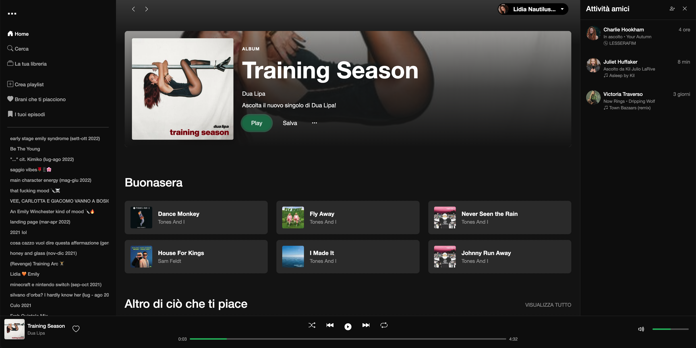

<h1 align="center">
    
</h1>

Un'elegante replica dell'interfaccia di Spotify che permette di cercare artisti, visualizzare album e riprodurre anteprime di brani utilizzando l'API di Deezer.


**👉 [Visualizza la versione live del progetto](https://4-1-build-week-ch-1.vercel.app/)**

## 📋 Descrizione

Questo progetto è un clone di Spotify che replica l'esperienza utente dell'app originale. Sviluppato con tecnologie web moderne, offre un'interfaccia reattiva e user-friendly che funziona su tutti i dispositivi. Utilizza l'API di Deezer per accedere a un vasto catalogo musicale.

## 🚀 Tecnologie Utilizzate

- **HTML5**: Struttura semantica del documento web
- **CSS3**: Stile e layout responsivo
- **JavaScript (ES6+)**: Logica di interazione e chiamate API
- **Bootstrap 5**: Framework CSS per un'interfaccia moderna e responsive
- **Fetch API**: Per effettuare richieste asincrone all'API di Deezer
- **Deezer API**: Fornitura di dati musicali (artisti, album, brani)
- **Bootstrap Icons**: Set di icone per migliorare l'interfaccia utente
- **Media Queries**: Adattamento dell'interfaccia a diverse dimensioni di schermo

## ⚙️ Caratteristiche

- Ricerca di artisti, album e brani tramite integrazione con API Deezer
- Riproduzione di anteprime audio con controlli del player
- Visualizzazione dettagliata di artisti con biografia e brani popolari
- Esplorazione di album con tracklist completa
- Player musicale completo con controlli di riproduzione
- Mini-player mobile per un'esperienza ottimizzata su smartphone
- Funzionalità di passaggio automatico alla traccia successiva
- Layout completamente responsive per tutti i dispositivi
- Navigazione tramite sidebar con playlist suggerite

## 🛠️ Installazione

```bash
# Clona il repository
git clone https://github.com/tuousername/spotify-clone.git

# Naviga nella directory del progetto
cd spotify-clone

# Apri il file index.html nel tuo browser
# Oppure utilizza un server locale come Live Server
```

## 🖥️ Utilizzo

Il progetto è completamente client-side e può essere utilizzato aprendo il file `index.html` in un browser. Le principali funzionalità includono:

- **Home**: Visualizza album in evidenza e contenuti suggeriti
- **Pagina Artista**: Esplora biografia, brani popolari e album di un artista
- **Pagina Album**: Visualizza tutti i brani contenuti in un album specifico
- **Ricerca**: Cerca artisti e brani utilizzando la barra di ricerca
- **Player**: Controlla la riproduzione dei brani con il player integrato

## 📸 Screenshot



## 💻 Struttura del Progetto

```
spotify-clone/
├── css/                # Fogli di stile
│   ├── style.css       # Stili globali
│   ├── player.css      # Stili del player
│   ├── album.css       # Stili pagina album
│   ├── artist.css      # Stili pagina artista
│   └── search-mobile.css  # Stili mobile per ricerca
├── js/                 # Script JavaScript
│   ├── script.js       # Script principale
│   ├── player.js       # Logica del player
│   ├── album.js        # Gestione pagina album
│   ├── artist.js       # Gestione pagina artista
│   └── search.js       # Funzionalità di ricerca
├── img/                # Immagini e risorse
├── index.html          # Homepage
├── album.html          # Pagina album
├── artist.html         # Pagina artista
└── search.html         # Pagina di ricerca
```

## 🤝 Contributi

Le contribuzioni sono sempre benvenute! Apri una **issue** o invia un **pull request** per suggerire modifiche.

### 👨‍💻 Contributori

- [PaolaTaralloo](https://github.com/PaolaTaralloo)
- [SPIRIDION](https://github.com/SPIRIDION)
- [majoralpaca984](https://github.com/majoralpaca984)
- [henry8913](https://github.com/henry8913)
- [SilkySmooth91](https://github.com/SilkySmooth91)

---

## 👤 Autori

Progetto demo creato da [Team 1 - 4.1 Build Week CH1](https://4-1-build-week-ch-1.vercel.app/) per scopi didattici.

## 📝 Licenza

Questo progetto è distribuito sotto licenza [MIT](LICENSE.txt). Vedi il file `LICENSE.txt` per ulteriori dettagli.